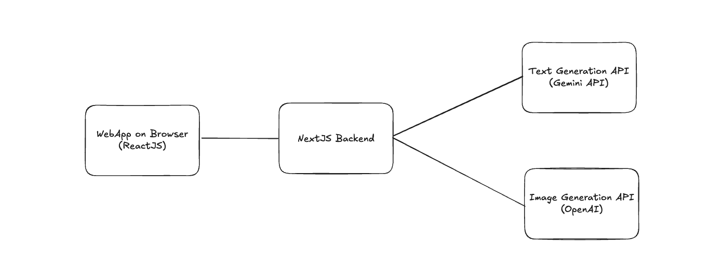

# PaperPlay - Craft a story interactively with AI

The motivation is to write a story without waiting for the perfect inspiration.

## Setup

- Prepare API keys (Gemini and OpenAI).
- Rename `.env.example` to `.env` and paste in your keys.
- Install packages `npm install`
- Run the development server `npm run dev`

Open [http://localhost:3000](http://localhost:3000) with your browser to see the result.

## How it works

You are given by an objective and some constraints. You have to write the story that reaches that objective while satisfying all the constraints. Once you done with one scene, you think of the objective and the constraints that the next player has to write with. In this case, the next player is just an Gemini AI. You write back and forth until you have 5 or 7 scenes for a story.

We can also generate an image to describe each scene. Once we have written some scenes, we can put everything in one page and enjoy the story.

## Tools

- Frontend and backend are powered by NextJS Framework, which uses ReactJS.
- We use Gemini API for text generation and use OpenAI for image generation.
  

## Others

This is a [Next.js](https://nextjs.org/) project bootstrapped with [`create-next-app`](https://github.com/vercel/next.js/tree/canary/packages/create-next-app).
